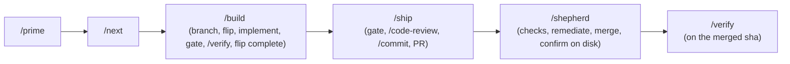

# The Governed Loop

The skills chain into a single governed development loop. This page shows how
they connect end to end, where checkpoints halt for approval, and what binds
them together.

## The loop

## How the skills chain

In the order `AGENTS.md` "Working the backlog" runs it. One spec per session.

| Phase | Skill | What happens | Output |
|---|---|---|---|
| Prime | `/prime` | Execute the New Sessions protocol: rules, parallel reads, `spec-spine check`, lifecycle counts. Reads only | `primed:` summary |
| Pick | `/next` | The ready set from `registry plan`, minus drafts, with in-flight specs and blockers named | one spec id |
| Build | `/build <id>` | Preflight, branch, flip `in-progress`, implement inside the territory, the gate before every commit (`/commit`), `/verify`, flip `complete` | commits on the feature branch |
| Ship | `/ship` | The gate locally, `/code-review` on the diff, `/commit`, push, `gh pr create`. The waiver is a human checkpoint | an open PR |
| Shepherd | `/shepherd` | Checks by head sha, review threads, remediation through the gate (two rounds), squash merge, merge confirmed on disk | the merged default branch |
| Verify | `/verify <id>` | The spec's `## Verification` block through `spec-spine verify`, the verb an orchestrator's verify stage runs after merge | exit codes, honestly |
| File | `/spec` | The next spec at the next free ordinal, born `draft`; approval stays a human flip | a draft spec |

`/setup` runs once per contributor before any of this. `/commit` and
`/code-review` are the two skills the loop calls rather than stages of it.

## Checkpoint discipline

Checkpoints are real stops where a skill halts and waits for a human:

1. **`/build` preflight**: a draft spec, an unmet dependency, a dirty tree, a missing operator prerequisite, or a contradiction between the spec and what the code must do.
2. **`/ship` waiver**: if the coupling gate fails and a `Spec-Drift-Waiver:` is the only remedy. Standing authorization never covers this.
3. **`/ship` PR creation**: before pushing and opening the PR (outward-facing), unless the session carries an orchestrator's run-start authorization.
4. **`/shepherd`**: a `DIRTY` or `BEHIND` PR, a third red round, or a waiver-shaped failure.

An agent that blows past a checkpoint violates `orchestrator-rules`.

## Halting rules

The loop stops, reports full context, and does not improvise when:

- a local CI failure is not mechanically fixable;
- the coupling gate fails and neither fixing the coupling nor a waiver is
  appropriate;
- a spec edit would retroactively justify a contradicting action (the coherence
  guard, see [`adversarial-prompt-refusal`](./rules.md));
- any step cannot proceed without improvising outside the playbook.

## Key dependencies

| Dependency | Skills that require it |
|---|---|
| spec-spine CLI | every skill; `/setup` installs the pinned version |
| the gate as `AGENTS.md` lists it | `/build`, `/ship`, `/shepherd` |
| a pre-PR gate (coupling + index freshness) | `/ship`, and the `PreToolUse` hook |
| `orchestrator-rules` | every orchestrated skill |
| `governed-artifact-reads` | every `.derived/` read |
| `gh` CLI | `/ship`, `/shepherd` |
